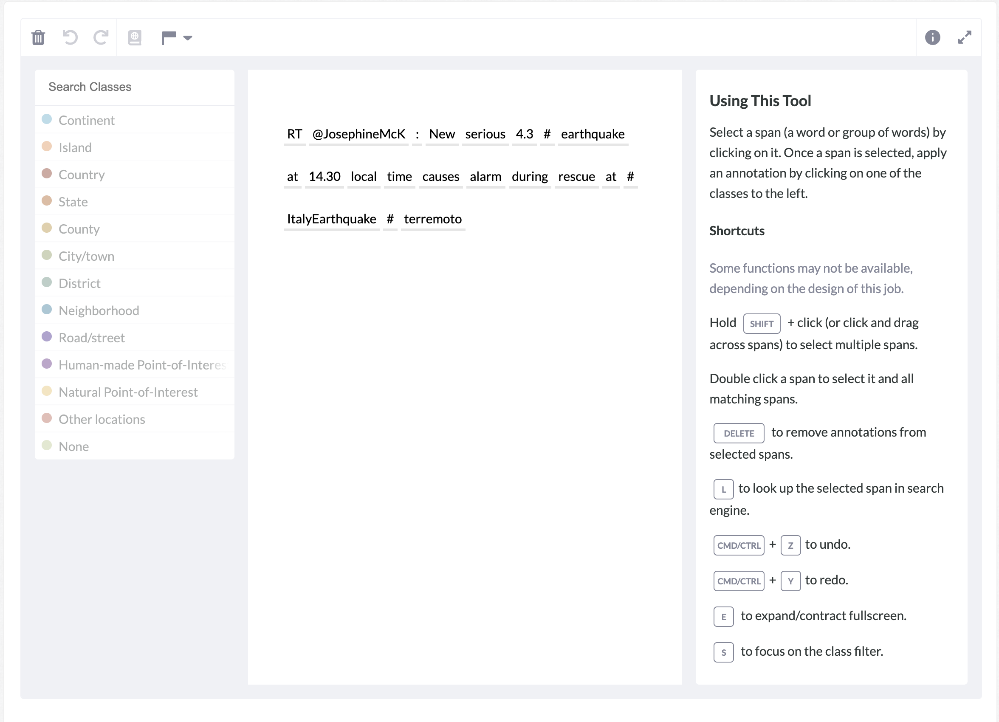
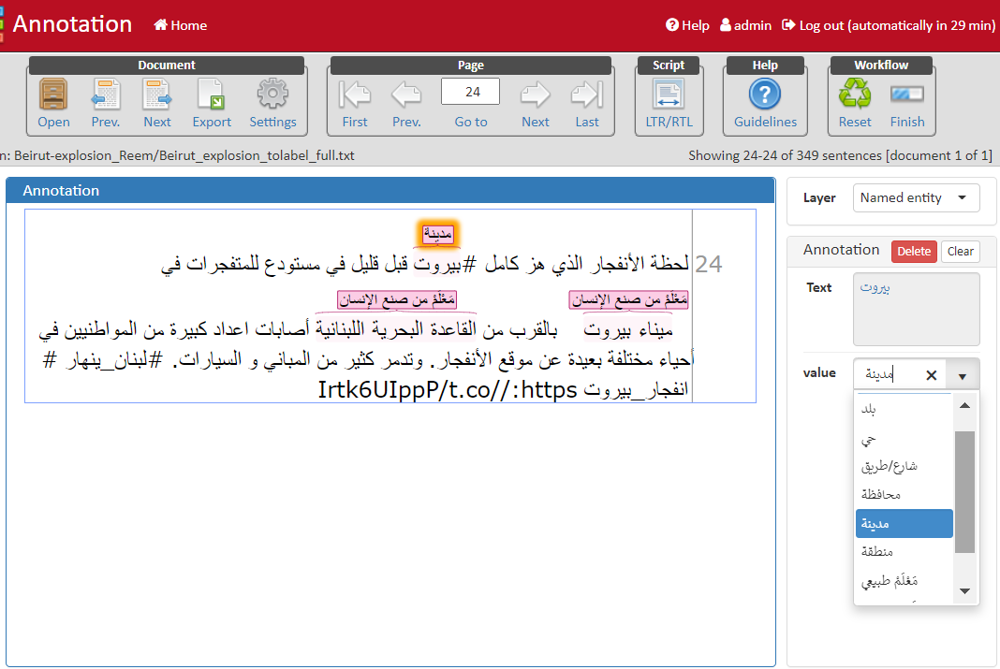

## Annotation Guidelines.
To read the annotation guidelines, read the documents in this directory.

For English datasets, the annotations were collected using crowd workers through [Appen](https://appen.com/) plateform:

For Arabic datasets, the annotations were collected using in-house workers through [WenAnno](https://webanno.github.io/webanno/) plateform:

